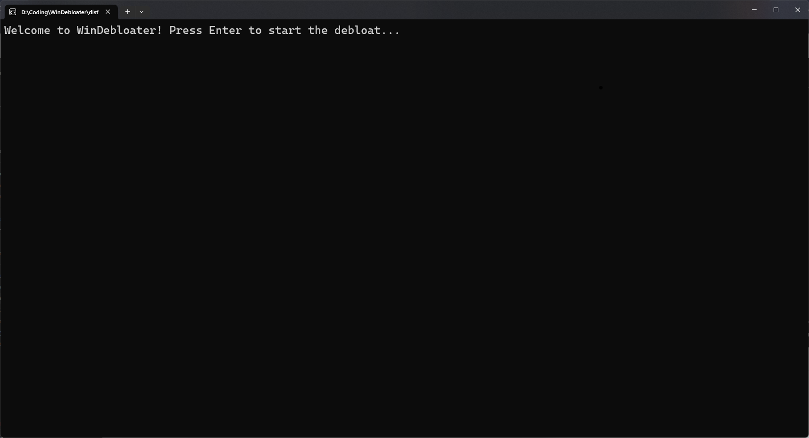

# WinDebloater
This is WinDebloater by crazycheetah42. It is a script written in Python which uses PowerShell's Get-AppxPackage and Remove-AppxPackage cmdlets to remove bloatware from a specific list.

It is available as an executable which was generated through PyInstaller, which you can access through the Releases page.